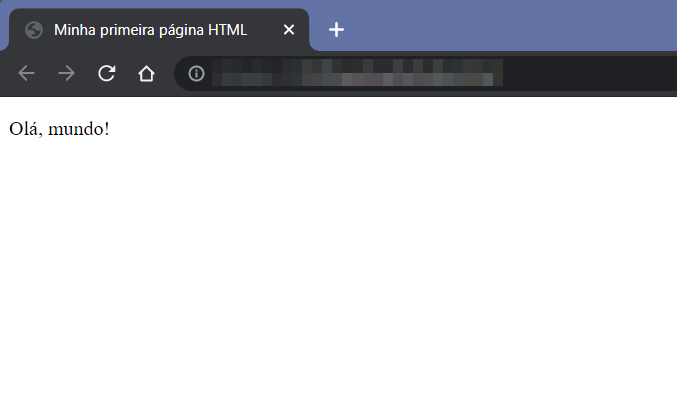
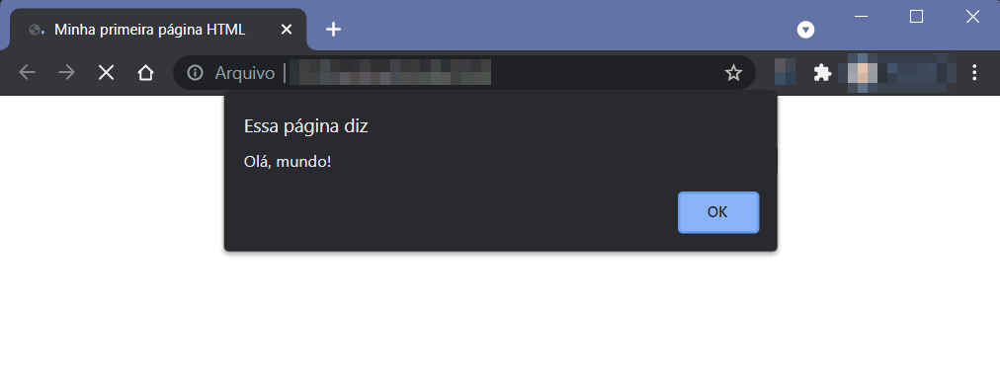

# COMEÇANDO COM JAVASCRIPT

## O JavaScript e as páginas Web

As páginas Web são formadas pela combinação de três tecnologias:

* **HTML** (*Hypertext Markup Language*, isto é, linguagem de marcação de hipertexto): é responsável por estruturar o conteúdo da página, ou seja, **o que** você vê nela.
* **CSS** (*Cascading Style Sheets*, folhas de estilo em cascata): cuida da aparência da página, como cores, fontes e alinhamento dos elementos. Controla **como** o conteúdo é exibido na página.
* **JavaScript**: é uma linguagem de **programação** que pode ser adicionada às páginas Web, conferindo-lhes interatividade para com o usuário. O JavaScript é capaz, por exemplo, de verificar em um formulário se o usuário digitou algo diferente do esperado ou de fazer coisas se movimentarem pela página.

O JavaScript será o objeto do nosso estudo. No entanto, como iremos utilizá-lo **dentro** de uma página Web, precisamos saber e entender o básico de HTML.

# A estrutura de uma página HTML

Uma página Web (também chamada de página HTML) é um arquivo de texto simples com extensão `.html` ou `.htm`. A listagem a seguir apresenta a estrutura básica de um arquivo HTML.

```{ .html .number-lines }
<!DOCTYPE html>
<html>
<head>
    <meta charset="UTF-8">
    <title>Minha primeira página HTML</title>
</head>
<body>
    <p>Olá, mundo!</p>
</body>
</html>
```

| IMPORTANTE |
|------------|
| Os números que aparecem à esquerda do código **não** fazem parte dele. Servem apenas para que possamos nos referir a diferentes partes do código usando o número da linha. |

Como podemos ver, o HTML é formado por elementos delimitados pelos caracteres `<` e `>`, os quais são chamados **tags**.

Muitas *tags* vêm em pares, formando **seções**. Podemos observar, por exemplo, que a tag `<body>`, chamada *tag* de abertura, tem a correspondente *tag* de fechamento `</body>` (note a presença da `/` antes do nome da *tag*). 

Agora, vamos analisar cada uma das partes desse código.

* `<!DOCTYPE html>` (linha 1): essa *tag* serve para indicar ao navegador Web que irá exibir a página qual a versão da linguagem HTML está sendo usada. No caso, esse *doctype* indica que se trata da versão 5 do HTML, a mais recente.
* Seção **html** (linhas 2 a 10): a maior parte do código da página fica nessa grande seção. Dentro dessa grande seção, temos as seções **head** e **body**.
* Seção **head** (linhas 3 a 6): aqui colocadas *tags* de configuração da página, como a `<meta charset="UTF-8">` (linha 4), para garantir que os caracteres acentuados sejam exibidos corretamente. Os elementos dessa seção, normalmente, não têm um efeito visível para o usuário. Uma exceção é a *tag* `<title>` (linha 5), cujo conteúdo aparece na aba do navegador onde a página estiver sendo exibida.
* Seção **body** (linhas 7 a 9): todo o conteúdo da página que será visível para o usuário é colocado nessa seção. No código de exemplo, temos um parágrafo (`<p>`, linha 8) contendo um texto a ser exibido.

Quando o arquivo HTML contendo este código for exibido em um navegador Web, veremos um resultado semelhante a este:



## Adicionando JavaScript a uma página HTML

Para utilizar JavaScript em uma página HTML, precisamos criar uma seção `<script></script>`, normalmente dentro da seção **head**, e adicionar o código JavaScript dentro dela.

O código listado a seguir irá apresentar uma nova versão da mensagem "Olá, mundo!" mas, desta vez, quem dará o recado é a linguagem JavaScript.

```{ .html .number-lines }
<!DOCTYPE html>
<html>
<head>
    <meta charset="UTF-8">
    <title>Minha primeira página HTML</title>
    <script>
        alert('Olá, mundo!')
    </script>
</head>
<body>
    
</body>
</html>
```
Observe com atenção as linhas 6 a 8. Aberto no navegador, um arquivo HTML com este código produz o seguinte resultado:



Portanto, agora você já sabe. Toda vez que formos usar JavaScript em uma página Web, devemos:

1. Criar um arquivo com extensão `.html` ou `.htm`.
2. Colocar dentro desse arquivo a estrutura básica de um arquivo HTML. Editores de código, como o [Visual Studio Code](https://code.visualstudio.com) ou o [Gitpod](https://gitpod.io) possuem recursos que geram automaticamente este código.
3. Adicionar uma seção `<script></script>` na seção **head** e colocar as instruções JavaScript dentro dela.