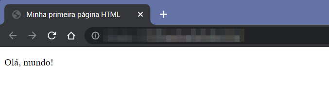

# COMEÇANDO COM JAVASCRIPT

## Uma breve história do JavaScript (sim, é importante!)

Em 1989, [Tim Berners-Lee](https://pt.wikipedia.org/wiki/Tim_Berners-Lee) inventou a linguagem HTML e, com ela, a possibilidade de criar páginas Web. Isso revoluciou a Internet da época, que, até então, era acessada principalmente por terminais de texto, com suporte muito limitado a imagens e outros tipos de mídia. Essa "nova" internet passou a ser conhecida pela sigla WWW (de *World Wide Web*, Teia de Alcance Mundial).

As páginas Web de Berners-Lee fizeram muito sucesso. Mas elas tinham uma limitação: apenas entregavam conteúdo multimídia, de forma estática, como a televisão. Não havia forma de o usuário interagir com esse conteúdo, nem de enviar informações de volta à origem. E isso restringia as possibilidades de uso das páginas Web.

Em 1994, o [Netscape Navigator](https://pt.wikipedia.org/wiki/Netscape_Navigator) era o navegador Web líder de mercado. Para resolver o problema da falta de interatividade, a empresa Netscape decidiu por introduzir uma linguagem de programação que pudesse ser incorporada às páginas Web e executada pelo navegador ao carregá-las.

A linguagem em questão, depois de muitos nomes provisórios, ganhou o nome de JavaScript, tendo sido lançada em 1995. Foi desenvolvida originalmente por [Brendan Eich](https://pt.wikipedia.org/wiki/Brendan_Eich), que, nos dias de hoje, é o nome por trás do navegador [Brave](https://brave.com), focado em privacidade e eliminação de propagandas indesejadas.

A escolha pelo nome JavaScript não foi por acaso, tratando-se, na verdade, de uma bela jogada de *marketing*. Na época do lançamento, uma outra linguagem, também recém-surgida, estava fazendo bastante sucesso: o [Java](https://pt.wikipedia.org/wiki/Java_(linguagem_de_programa%C3%A7%C3%A3o)), da empresa Sun Microsystems. A intenção da Netscape era embarcar na popularidade do Java, mas, no fim das contas, acabou por causar uma grande confusão, levando muitos a acreditar que o JavaScript era baseado em Java. No entanto, **JavaScript e Java são linguagens totalmente diferentes**, tanto em finalidade quanto na forma de se programar e, ainda hoje, os mais desavisados pensam que se trata da mesma coisa por causa da semelhança do nome.

A Microsoft, uma das gigantes da tecnologia já naquela época, não podia ficar de fora da onda da WWW. Em 1996, a empresa lançou o [Internet Explorer](https://pt.wikipedia.org/wiki/Internet_Explorer) 3.0 com sua própria "versão" da linguagem JavaScript, a qual denominou JScript. O JScript possuía várias extensões e diferenças em relação ao JavaScript original, fazendo com que *websites* feitos com ele só funcionassem corretamente no Internet Explorer.

Diante desse fato, em novembro de 1996, a Netscape anunciou que havia submetido o JavaScript à [ECMA](https://www.ecma-international.org/) (*European Computer Manufacturers Association*, ou Associação Europeia de Fabricantes de Computadores) como candidata a padrão industrial. Com isso, a empresa abriu as especificações da linguagem para o público, como se quisesse dizer que "não tinha nada a esconder", ao contrário da concorrente. O trabalho que se seguiu resultou na versão padronizada chamada **ECMAScript** (ECMA-262), versão 1.0 (junho de 1997). O padrão foi evoluindo ao longo dos anos, sendo a versão mais recente a ES2020 (ECMAScript 2020), lançada em junho de 2020. Atualmente, o ECMAScript é considerado o padrão de JavaScript a que todo navegador deve dar suporte.

Contudo, a chamada Primeira Guerra dos *Browsers* (~ 1995—2001) não demorou a começar. A Microsoft passou a fornecer seu navegador junto com o sistema operacional Windows, fazendo com que as pessoas não mais precisassem recorrer ao *download* do Netscape para ter um programa do tipo. Durante praticamente toda a primeira década do século, o Internet Explorer reinou absoluto na liderança do mercado de navegadores. Com a posição alcançada, a Microsoft ignorava o padrão ECMAScript, investindo em suas extensões proprietárias. Desenvolver para a Web tornou-se caótico, devido à falta de compatibilidade entre o JScript do Internet Explorer com o JavaScript padrão.

A empresa Netscape fechou as portas em 2002, exaurida por uma longa batalha judicial contra a Microsoft. Dos escombros da Netscape surgiram dois projetos, que resultaram nos navegadores [Opera](https://www.opera.com/pt-br) e [Firefox](https://www.mozilla.org/pt-BR/firefox/), que existem até hoje. Embora fossem bons produtos e tivessem alcançado algum destaque, nenhum deles tinha força para competir com a toda poderosa Microsoft.

Foi necessário que outra gigante da tecnologia entrasse no páreo para ameaçar a liderança da Microsoft e do Internet Explorer entre os navegadores, iniciando a Segunda Guerra dos *Browsers*. Em 2008, a Google lançou o [Google Chrome](https://www.google.com/intl/pt-BR/chrome/), com importantes diferenciais. Seu mecanismo de processamento de JavaScript, chamado V8, era extremamente rápido, fazendo com que as páginas Web carregassem bem mais depressa que no Internet Explorer. Além disso, o Chrome era baseado em um projeto de código aberto chamado [Chromium](https://www.chromium.org/chromium-projects), o que incentivou desenvolvedores a colaborar para o aperfeiçoamento do produto. Mais do que isso, a Google adotou como princípio a aderência aos chamados "padrões Web", dentre os quais se encontra o ECMAScript.

Por volta de 2013, cinco anos após seu lançamento, o Google Chrome conquistou a liderança do mercado de navegadores. A Microsoft se viu obrigada a substituir o Internet Explorer por um novo navegador, o Edge, mais conforme aos padrões Web. 

Antes, em 2010, aproveitando-se do fato de o Chrome ter seu código-fonte aberto, Ryan Dahl isolou o código do interpretador de JavaScript V8 e criou o [Node.js](https://nodejs.org/en/). Este *software* permite com que o JavaScript, uma linguagem de Internet projetada para ser executada dentro do navegador, possa ser executado também fora dele, tornando-a uma linguagem de propósito geral.

A aderência do Google aos padrões Web, a derrocada do Internet Explorer e seu JScript não-padrão e a popularidade do Node.js levaram a um impulsionamento do desenvolvimento da linguagem JavaScript, que vem ganhando uma nova versão por ano desde 2015, quando foi lançada a versão ES6.

A versão ES6 representou um marco de modernização na linguagem, e as versões subsequentes prosseguiram com a adição de funcionalidades. **Esta apostila tem como um de seus objetivos ensinar o JavaScript moderno**, abrangendo as principais características introduzidas desde o ES6, sem deixar de mencionar as formas originais, quando existirem.

## Características da linguagem JavaScript

Dentre os principais atributos da linguagem, podemos destacar:

* ela é **interpretada**, ou seja cada linha de código é transformada em linguagem de máquina à medida que vai sendo executada pelo navegador. Existe um outro tipo de linguagem, as compiladas, em que todo o código de um programa é transformado em linguagem de máquina para só então poder ser executado.
* ela é **imperativa**: você deve fornecer instruções claras de como conseguir o que quer, assim como em Python, VBA e C, entre outras linguagens. Já nas linguagens do tipo declarativo, é necessário dizer apenas o que se quer, sem precisar indicar as instruções passo a passo.
* ela é **estruturada**, possuindo estruturas de construção de blocos lógicos de código, como a grande maioria das linguagens de programação utilizadas na atualidade. Sua sintaxe (forma de escrever as instruções) assemelha-se à das linguagens C e PHP.
* ela tem **tipagem dinâmica**: não é necessário indicar o tipo ao declarar uma variável, sendo ele determinado a partir do valor armazenado na variável. Como consequência, uma mesma variável pode inicialmente guardar um número e, mais tarde, ter seu valor trocado por uma *string*.

Caso você tenha tido contato com JavaScript antes, principalmente se há mais de cinco anos, pode se lembrar de que era costume colocar um `;` (ponto-e-vírgula) ao final de cada linha de código, como terminador de instruções. Saiba que esses **ponto-e-vírgulas finais são opcionais** em JavaScript (exceto em raríssimos casos), e, portanto, você não os verá nesta apostila.

## O JavaScript e as páginas Web

As páginas Web são formadas pela combinação de três tecnologias:

* **HTML** (*Hypertext Markup Language*, isto é, linguagem de marcação de hipertexto): é responsável por estruturar o conteúdo da página, ou seja, **o que** você vê nela.
* **CSS** (*Cascading Style Sheets*, folhas de estilo em cascata): cuida da aparência da página, como cores, fontes e alinhamento dos elementos. Controla **como** o conteúdo é exibido na página.
* **JavaScript**: é uma linguagem de **programação** que pode ser adicionada às páginas Web, conferindo-lhes interatividade para com o usuário. O JavaScript é capaz, por exemplo, de verificar em um formulário se o usuário digitou algo diferente do esperado ou de fazer coisas se movimentarem pela página.

A linguagem JavaScript será o objeto do nosso estudo. No entanto, como iremos utilizá-la **dentro** de uma página Web, é necessário aprender o básico de HTML.

## A estrutura de uma página HTML

Uma página Web (também chamada de página HTML) é um arquivo de texto simples com extensão `.html` ou `.htm`. A @lst:html seguir apresenta a estrutura básica de um arquivo HTML.

```{ #lst:html caption="Estrutura básica de um arquivo HTML" .html .number-lines }
<!DOCTYPE html>
<html>
<head>
    <meta charset="UTF-8">
    <title>Minha primeira página HTML</title>
</head>
<body>
    <p>Olá, mundo!</p>
</body>
</html>
```

| IMPORTANTE |
|------------|
| Os números que aparecem à esquerda do código **não** fazem parte dele. Servem apenas para que possamos nos referir a diferentes partes do código usando o número da linha. |

Como podemos ver, o HTML é formado por elementos delimitados pelos caracteres `<` e `>`, os quais são chamados **tags**.

Muitas *tags* vêm em pares, formando **seções**. Podemos observar, por exemplo, que a tag `<body>`, chamada *tag* de abertura, tem a correspondente *tag* de fechamento `</body>` (note a presença da `/` antes do nome da *tag*). 

Agora, vamos analisar cada uma das partes desse código.

* `<!DOCTYPE html>` (linha 1): essa *tag* serve para indicar ao navegador Web que irá exibir a página qual a versão da linguagem HTML está sendo usada. No caso, esse *doctype* indica que se trata da versão 5 do HTML, a mais recente.
* Seção **html** (linhas 2 a 10): a maior parte do código da página fica nessa grande seção. Dentro dessa grande seção, temos as seções **head** e **body**.
* Seção **head** (linhas 3 a 6): aqui colocadas *tags* de configuração da página, como a `<meta charset="UTF-8">` (linha 4), para garantir que os caracteres acentuados sejam exibidos corretamente. Os elementos dessa seção, normalmente, não têm um efeito visível para o usuário. Uma exceção é a *tag* `<title>` (linha 5), cujo conteúdo aparece na aba do navegador onde a página estiver sendo exibida.
* Seção **body** (linhas 7 a 9): todo o conteúdo da página que será visível para o usuário é colocado nessa seção. No código de exemplo, temos um parágrafo (`<p>`, linha 8) contendo um texto a ser exibido.

Quando o arquivo HTML contendo este código for exibido em um navegador Web, veremos um resultado semelhante ao da @fig:cap01-01:

{#fig:cap01-01}

## Adicionando JavaScript a uma página HTML

Para utilizar JavaScript em uma página HTML, precisamos criar uma seção `<script></script>`, normalmente dentro da seção **head**, e adicionar o código JavaScript dentro dela.

A @lst:js-html apresenta uma nova versão da mensagem "Olá, mundo!" mas, desta vez, quem dará o recado é a linguagem JavaScript.

```{ #lst:js-html caption="Código JavaScript em uma página HTML" .html .number-lines }
<!DOCTYPE html>
<html>
<head>
    <meta charset="UTF-8">
    <title>Minha primeira página HTML</title>
    <script>
        alert('Olá, mundo!')
    </script>
</head>
<body>
    
</body>
</html>
```
Observe com atenção as linhas 6 a 8. Aberto no navegador, um arquivo HTML com este código produz o seguinte resultado (@fig:cap01-02):

{#fig:cap01-02}

Portanto, agora você já sabe. Toda vez que formos usar JavaScript em uma página Web, devemos:

1. Criar um arquivo com extensão `.html` ou `.htm`.
2. Colocar dentro desse arquivo a estrutura básica de um arquivo HTML. Editores de código, como o [Visual Studio Code](https://code.visualstudio.com) ou o [Gitpod](https://gitpod.io) possuem recursos que geram automaticamente este código.
3. Adicionar uma seção `<script></script>` na seção **head** e colocar as instruções JavaScript dentro dela.

### Adicionando comentários

Bons desenvolvedores não se preocupam apenas em escrever bem as instruções que serão executadas. Eles também cuidam da documentação, adicionando comentários que explicam os principais pontos, como forma de colaborar para que o código seja compreendido por outras pessoas (e até pelo autor, no futuro).

Todas as linguagens possuem maneiras de inserir comentários no código. Em JavaScript, eles assumem duas formas:

* **comentários de linha**: são iniciados com `//` (duas barras) e, como o próprio nome indica, terminam junto com o fim da linha onde foram colocados.
* **comentários de bloco**: começam com `/*` (barra asterisco) e terminam com `*/` (asterisco barra). Tudo o que estiver entre eles é considerado comentário, que pode ter várias linhas.

A @lst:comm exemplifica esses tipos de comentários. 

```{ #lst:comm caption="Comentários em JavaScript" .js .number-lines }
// Exibe uma mensagem em uma caixa de diálogo
alert('Olá, como vão seus estudos?')  // Posso comentar aqui tb

/* 
    A linha abaixo exibe um texto na área <body>
    do arquivo HTML
*/
document.write('Estou adorando aprender JavaScript!)
```

| IMPORTANTE |
|------------|
| A partir desta listagem, mostraremos apenas o código JavaScript. Você já sabe que ele precisa estar dentro das *tags* `<script></script>` do arquivo HTML, não é mesmo? ;) |

## Usando o console JavaScript

Todos os navegadores mais utilizados atualmente tem uma parte "secreta", desconhecida da maioria dos usuários. Essa parte é chamada de Ferramentas de Desevolvedor e pode ser acessada ao pressionar a tecla `F12`. Será aberto um painel, no lado direito ou inferior da tela, conforme mostrado na @fig:cap01-03.

{#fig:cap01-03}

> **DICA**: usando o menu de opções (2), é possível mudar o posicionamento das Ferramentas de Desenvolvedor na tela.

Na aba Console, é possível digitar instruções JavaScript, incluindo operações aritméticas, e ver imediatamente seu resultado. Veja alguns exemplos na @fig:cap01-04.

{#fig:cap01-04}

________________

No próximo capítulo, vamos aprender sobre variáveis e tipos de dados, e usaremos o console para fazer alguns testes.
