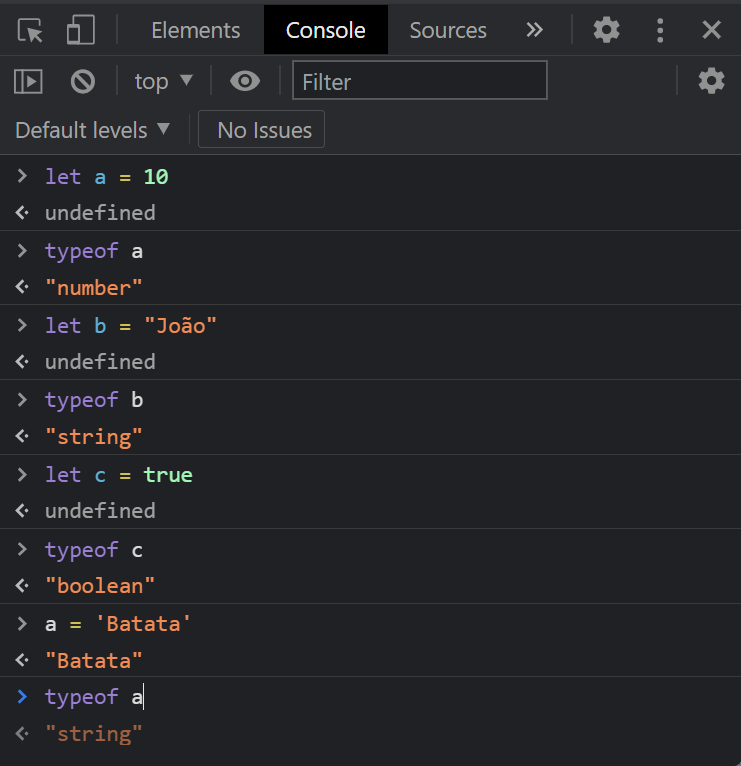

# VARIÁVEIS E TIPOS DE DADOS

## Declaração de variáveis

O Javascript é uma linguagem de tipagem dinâmica. Isso significa que os tipos de dados de suas variáveis não são determinados no momento em que são declaradas. Em vez disso, eles são deduzidos a partir dos **valores** atribuídos a elas.

Veja alguns exemplos na @lst:var1:

```{ #lst:var1 caption="Declarações de variáveis em JavaScript" .js .number-lines}
let x
var preco
const meuNome = 'Fausto'
```
>> **NOTE BEM**: para declarar uma variável em JavaScript, basta uma das palavras-chave reservadas (**`let`** ou **`var`**) seguida do nome da variável, nada mais. **`const`** exige também que um valor seja atribuído à variável no momento da declaração.

Há três palavras-chave utilizadas para declarar variáveis em JavaScript:

* **`let`**: atualmente, é o método recomendado de criação de variáveis. Uma das vantagens de sua utilização é a impossibilidade de se declarar mais de uma variável com o mesmo nome, o que ajuda a evitar erros de lógica no código. Possui também outros benefícios e características que serão explicadas ao longo desta apostila. É uma adição relativamente recente à linguagem (foi introduzida na versão ES6, de 2015).
* **`var`**: é a palavra-chave originalmente disponível para a declaração de variáveis, desde a primeira versão do JavaScript. Seu uso apresenta alguns problemas, como a possibilidade de redeclarar uma variável já existente, o que pode induzir a erros de lógica. Evite utilizá-la, até compreender completamente as consequências de seu emprego.
* **`const`**: em algumas situações, é necessário representar valores que não devem mais ser alterados posteriormente. São as chamadas **constantes**. Variáveis declaradas com **`const`** devem receber um valor quando declaradas e não aceitam que este valor seja modificado depois.

Várias variáveis podem ser declaradas simultaneamente (@lst:var2):

```{ #lst:var2 caption="Declarações múltiplas de variáveis".js .number-lines}
let quantidade, precoUnitario, precoTotal
let nome, email, telefone, celular
```

### Nomeando variáveis

Em JavaScript, nomes de variáveis devem começar com uma letra; os caracteres `$` e `_` também são aceitos primeira posição. Dígitos (`0` a `9`) podem ser utilizados a partir da segunda posição.

Você também não pode usar para nomear variáveis nenhuma das [palavras reservadas](https://developer.mozilla.org/pt-BR/docs/Web/JavaScript/Reference/Lexical_grammar#palavras-chave) pelo JavaScript para o seu próprio uso.

É importante frisar que JavaScript é uma **linguagem sensível à diferença entre letras maiúsculas e minúsculas** (*case sensitive*, em inglês), isto é, ela trata letras maiúsculas e minúsculas como coisas diferentes. Assim, uma variável de nome `num` é diferente de outra variável de nome `NUM`, e ambas são diferentes de uma terceira variável nomeada como `Num`.

Apesar de as especificações da linguagem JavaScript assim permitirem, não é recomendável declarar variáveis que contenham caracteres acentuados.

```{ #lst:var3 caption="Exemplos de nomeação de variáveis" .js .number-lines}
let x       // OK!
let primeiroNome    // OK!
let 1nome   // INVÁLIDO: começa com um dígito
let $valor  // OK, mas pouco usual
let _num    // OK, mas pouco usual
let %resultado  // Caractere inicial INVÁLIDO
let área    // OK, mas acentos não são recomendados
```
### Convenções de nomeação de variáveis

Quando muitos desenvolvedores trabalham num mesmo projeto, é comum que surja, mais cedo ou mais tarde, alguma discórdia sobre a forma de nomear as variáveis.

Por isso, as comunidades de cada linguagem acabam adotando convenções, que não são regras definidas na própria linguagem, mas sim uma espécie de "combinado" entre seus membros.

A convenção mais comum entre os desenvolvedores JavaScript é a seguinte:

1. **Sempre iniciar** o nome das variáveis com uma **letra minúscula**; e
2. Se o nome da variável for composto por **mais de uma palavra**, é utilizada **inicial maiúscula a partir da segunda** palavra.

Observe os exemplos da @lst:var4:

```{ #lst:var4 caption="Uso da convenção 'camel case' na nomeação de variáveis" .js .number-lines}
// Uma palavra, inicial minúscula
let area
// Duas palavras, a segunda com inicial maiúscula
let areaTerreno
// Três palavras, iniciais maúsculas a partir da segunda
let areaTerrenoPadrao
```

>> **CURIOSIDADE**: esse tipo de convenção é chamado, em inglês, de *camel case* (*camel* significa "camelo"). O motivo é que as letras maúsculas no meio do nome das variáveis acabam se parecendo com as corcovas do animal.

## Atribuindo valores a variáveis

Para atribuir valor a uma variável, é usado o operador `=` em JavaScript. A @lst:inic exemplifica os diferentes formas de atribuição.

```{ #lst:inic caption="Exemplos de atribuição de valores a variáveis" .js .number-lines}
let quantidade, valor

quantidade = 7
valor = 12.63

// Podemos atribuir um valor à variável quando a declaramos
let cargo = 'Gerente'

/* Podemos, inclusive, fazer várias declarações/atribuições
   de uma só vez */
let marca = 'Volkswagen', modelo = 'Fusca', ano = 1969
```
A atribuição de valores pode ocorrer posteriormente à declaração da variável (linhas 3 e 4) ou acontecer ao mesmo tempo que esta (linhas 7 e 10). Neste último caso, dizemos que a variável, além de declarada, foi **inicializada**.

## Tipos de dados

Vamos analisar em detalhes os **tipos de dados** disponíveis na linguagem JavaScript. Usaremos, como referência e exemplo, a @lst:atrib.

```{ #lst:atrib caption="Exemplos de tipos de dados" .js .number-lines}
let nome, sobrenome, naturalidade, idade, altura, peso, casado
let conjuge, ocupacao, filhos, nomeCompleto
nome = "Afrânio" // string 
sobrenome = 'Azeredo' // string
naturalidade = `Morro Alto de Cima (MG)` // string
idade = 44 // number
altura = 1.77 // number
peso = undefined // undefined
casado = true // boolean
conjuge = { nome: 'Jeruza', sobrenome: 'Jordão' } // object
ocupacao = null // object
filhos = ['Zózimo', 'Zuleica'] // object
nomeCompleto = function(nome, sobrenome) {  // function
    return nome + " " + sobrenome
}
```

* **string** (linhas 3 a 5): representa uma sequência de caracteres, ou seja, um texto. Em JavaScript, *strings* podem ser delimitadas com aspas duplas (`"`), aspas simples (`'`) ou acentos graves (<code>`</code>), muitas vezes chamados também de crases. Aspas simples e aspas duplas são totalmente equivalentes entre si, e a escolha por uma ou por outra acaba sendo decisão do programador. Já as *strings* delimitadas por acentos graves têm significado e funções especiais, que serão explicadas mais à frente.
* **number** (linhas 6 e 7): ao contrário de outras linguagens de programação, o JavaScript não faz distinção entre números inteiros e números com parte fracionária (também chamados de números de ponto flutuante), colocando-os todos sob um mesmo tipo. Para separar a parte inteira da parte fracionária, quando esta exista, é sempre usado o ponto (`.`), embora, na língua portuguesa, usemos a vírgula para esse fim. Existem várias outras formas de representar valores numéricos:
  - valores hexadecimais (base 16) podem ser representados usando-se o prefixo `0x`. Por exemplo `0x1A` representa o valor hexadecimal `1A` (equivalente a 26 em decimal).
  - valores octais (base 8) são representados usando-se um `0` no início. **CUIDADO!** Para o JavaScript, `045` não é um 45 decimal com um inútil zero à esquerda, e sim o valor octal `45` (que, convertido em decimais, equivale a 37).
  - Números muito grandes ou muito pequenos podem usar a chamada notação científica. Assim, `4e12` é o mesmo que `4` vezes `1` seguido de doze zeros, ou seja `4000000000000`.
  - Para números *realmente* grandes, foi introduzida na versão 2020 do EcmaScript mais um tipo de dados, o **bigint**. Você pode saber detalhes dessa novidade consultado a documentação da [Mozilla Developer Network](https://developer.mozilla.org/pt-BR/docs/Web/JavaScript/Reference/Global_Objects/BigInt).
* **undefined** (linha 8): é um tipo especial, usado para indicar que uma variável não tem qualquer valor atribuído a ela. A propósito, toda variável declarada e que ainda não recebeu um valor é considerada **`undefined`**.
* **boolean** (linha 9): como indicado pelo próprio nome, representa valores booleanos. Os únicos valores possíveis são **`true`** (verdadeiro) e **`false`** (falso), sempre escritos totalmente em minúsculas.
* **object** (linhas 10 a 12): é o tipo de dados mais versátil da linguagem, usado, normalmente, para armazenar vários valores em uma única variável. Os vetores (linha 12) e objetos em sentido estrito (linha 10) fazem parte desta categoria. **`null`** é um valor especial utilizado para representar um objeto inexistente.
* **function** (linhas 13 a 15): em JavaScript, funções podem ser atribuídas a variáveis. Essa característica é importante para usos de nível intermediário e avançado da linguagem.

### Descobrindo o tipo do valor de uma variável

Em JavaScript, embora as variáveis não tenham um tipo determinado, os valores que elas abrigam têm. Para descobrir qual o tipo de dados do valor em um dado momento, usamos o operador **`typeof`**.

Observe os testes feitos no console JavaScript mostrados na @fig:typeof.

{#fig:typeof width=12cm}

>> **OBSERVAÇÃO**: repare que as instruções que inicializam variáveis (começadas pela palavra **`let`**) retornaram **`undefined`**. Isso é normal, e significa que a instrução de inicialização da variável não retorna valor algum.

O operador **`typeof`** nos diz qual o tipo de dados que a variável possui **no momento do teste**. Veja o que aconteceu com a variável `a`. No primeiro teste, obtemos `"number"`, quando o valor que ela tinha era `10`. Mais à frente, depois que mudamos o valor de `a` para `"Batata"`, o teste retornou o tipo do novo valor, `"string"`. Com isso, não resta dúvida: **o que possui tipo é o valor da variável, não a variável em si mesma**.

________________

Agora que sabemos como funcionam as variáveis e tipos de dados em JavaScript, precisamos saber o que fazer com eles. Bora aprender operadores?