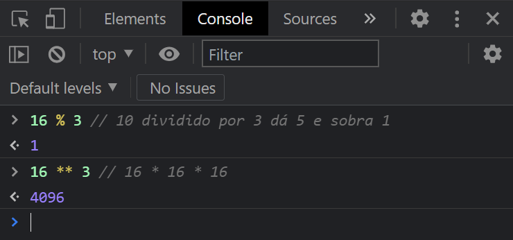
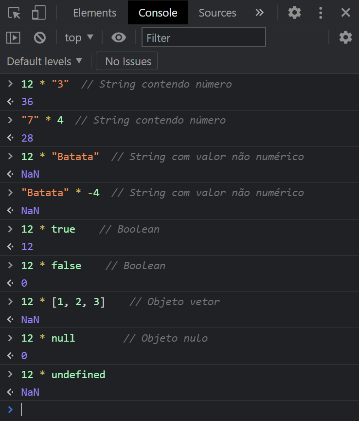
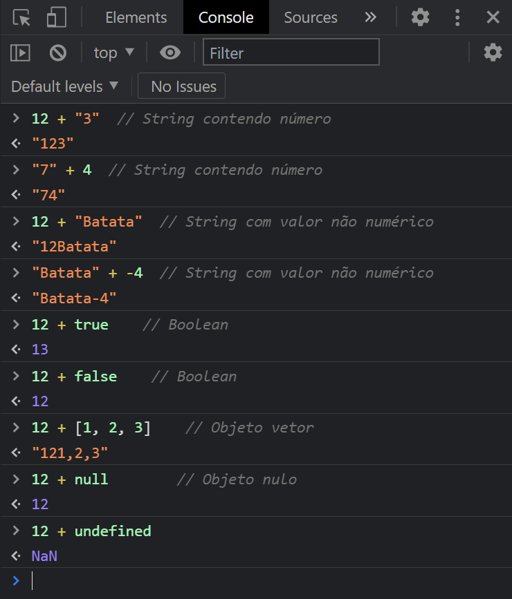
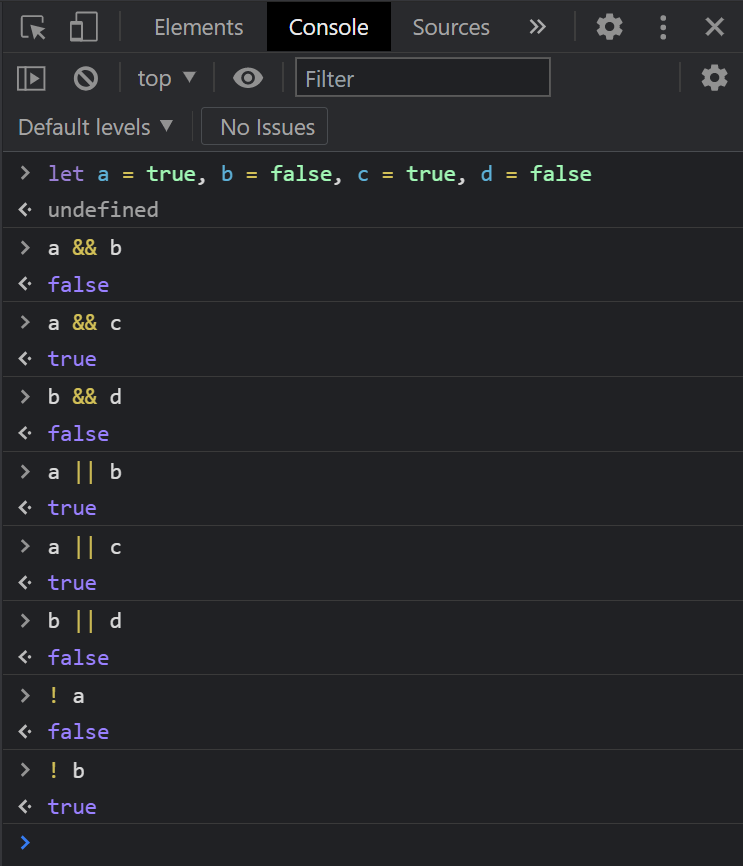

# OPERADORES

## Operadores aritméticos

Convivemos com os operadores aritméticos das quatro operações básicas desde o Ensino Fundamental. A maior parte das pessoas não terá problemas com os operadores das quatro operações aritméticas básicas. Quem usa computador há algum tempo sabe que o caractere `*` é usado para multiplicação e o caractere `/` é empregado na divisão.

É assim também no JavaScript, como ilustra a @fig:aritm.

{#fig:aritm width=12cm}

>> **OBSERVAÇÃO**: ao contrário da maioria das linguagens de programação (e até da sua calculadora), JavaScript não retorna erro quando há uma tentativa de divisão por zero. Em vez disso, ele retorna `Infinity` caso o dividendo seja positivo ou `-Infinity` se o dividendo for negativo. Existem razões matemáticas para tanto. Há uma bela discussão sobre isso [aqui](https://pt.stackoverflow.com/questions/214335/porque-javascript-retorna-infinity-em-vez-de-erro-ao-dividir-por-0).

Além deles, a linguagem conta com mais dois operadores aritméticos (@fig:mod-pot):

* **`%`**: é o operador de **resto da divisão**, também chamado de módulo da divisão. Calcula quanto sobra (o resto) da divisão de um número pelo outro.
* **`**`**: dois asteriscos consecutivos representam o operador de **potenciação**, que calcula o resultado do primeiro número elevado à potência do segundo.

{#fig:mod-pot width=12cm}

### Quando os operandos não são números

Os operadores aritméticos funcionam como esperado quando seus operandos são números. Mas, e quando não são? Aí **depende**.

Vamos fazer alguns testes com o operador de multiplicação (@fig:mult-nan).

{#fig:mult-nan width=12cm}

Sem dúvida, são resultados supreendentes. Vamos analisar caso a caso:

1. Quando um dos operandos é *string*, temos duas possibilidades:
   a) se o conteúdo da *string* equivaler a um valor numérico, o JavaScript efetua automaticamente a conversão de tipos e trata o valor da *string* como número, e temos o resultado da operação aritmética como se todos os operandos fossem numéricos.
   b) se o conteúdo da *string* não contiver um valor que possa ser convertido para número, a operação aritmética é impossível e recebemos, para indicar esse fato, o valor especial `NaN`, que significa **Not a Number** (não é um número).
2. No caso de um dos operandos ser *boolean*, o valor **`true`** é tratado como se valesse `1` e o valor **`false`** é considerado como `0`, e a operação aritmética é feita normalmente.
3. No caso de operandos do tipo *object*, não é possível efetuar a operação, portanto recebemos o resultado `NaN`. Uma exceção é o objeto nulo (**`null`**), que é tratado como `0` e possibilita a operação.

| CONFIRA VOCÊ MESMO(A) |
|------------|
| Resultados semelhantes são obtidos com os operadores de subtração (`-`), divisão (`/`), resto da divisão (`%`) e potenciação (`**`). Agora é a sua vez de abrir as Ferramentas do Desenvolvedor (tecle `F12` no navegador) e fazer seus próprios testes. |

Se você for observador(a), vai notar que eu não mencionei o operador `+` na observação anterior. Isso foi proposital, pois ele tem um comportamento diferente dos demais (@fig:add-str).

{#fig:add-str width=12cm}

Esquisito? Que nada, vamos entender o porquê desses resultados.

Primeiramente, precisamos aprender que o **operador `+`  tem duas funções** diferentes no JavaScript:

1. Se **todos os operandos forem numéricos**, ou puderem ser convertidos para números (ou tiverem valores equivalentes a números, como **`true`**, **`false`** e **`null`**), ele agirá como um **operador aritmético de adição**, como estamos acostumados.
2. No entanto, se **pelo menos um de seus operandos for uma *string***, ele terá a função de **operador de concatenação** de *strings*. Concatenar significa "emendar" uma *string* em outra. O JavaScript irá converter todos os demais operandos em *strings* e concatenará tudo em uma única *string* de resultado.

O operador `+` em conjunto com algum valor **`undefined`** sempre retornará `NaN`, e é um caso à parte.

| **IMPORTANTE** |
|------------|
| Comprender as duas funções do operador `+` (quando há e quando não há *strings* entre os operandos, ou seja, **concatenação** e **adição**, respectivamente) é **FUNDAMENTAL** para evitar frustrações futuras ao tratar com valores informados pelo usuário. |

## Operadores compostos de atribuição

Quem já estudou algoritmos sabe que uma das tarefas mais comuns em programação é a acumulação. Quando estamos somando uma lista de números por exemplo, iniciamos uma variável com o valor `0` e vamos **acumulando** o valor dos números, mais ou menos assim (@lst:acum):

```{ #lst:acum caption="Exemplo de acumulação em variável" .js .number-lines}
    // Somando os valores 10, 20, 30 e 40
    let soma = 0
    soma = soma + 10
    soma = soma + 20
    soma = soma + 30
    soma = soma + 40
    alert(soma)     // 100
```
Observe que, no processo de acumulação, a variável `soma` aparece **antes** e **depois** do sinal de atribuição (`=`). Para casos assim, o JavaScript dispõe de uma série de **operadores compostos de atribuição**, como o operador `+=`, que evitam a repetição do nome a variável. Usando-o, o código anterior fica assim (@lst:acum2):

```{ #lst:acum2 caption="Acumulação usando o operador '+='" .js .number-lines}
    // Somando os valores 10, 20, 30 e 40
    let soma = 0
    soma += 10
    soma += 20
    soma += 30
    soma += 40
    alert(soma)     // 100
```
Veja alguns dos outros operadores compostos de atribuição na @tbl:opattr:

| Nome | Operador | Exemplo de uso | Significado |
|------|----------|----------------|-------------|
| Atribuição de subtração | `-=` | `x -= 10` | `x = x - 10` |
| Atribuição de multiplicação | `*=` | `x *= 10` | `x = x * 10` |
| Atribuição de divisão | `/=` | `x /= 10` | `x = x / 10` |
| Atribuição de resto de divisão | `%=` | `x %= 10` | `x = x % 10` |
| Atribuição de potenciação | `**=` | `x **= 10` | `x = x ** 10` |
: Operadores de atribuição composta mais comuns {#tbl:opattr}

## Incremento e decremento

Sem dúvida, os operadores compostos de atribuição são muito práticos e deixam o código mais simples e limpo. Quer ainda mais praticidade? Outra tarefa comum em programação é aumentar ou diminuir o valor da variável numérica em uma unidade. Isso é chamado, respectivamente, de **incremento** e **decremento**.

Pois bem, o JavaScript possui operadores especializados para esses casos. Os operadores de incremento (`++`) e decremento (`--`) são **operadores unários**, isto é, agem sobre um único operando. Repare, na @lst:incdec, que eles podem vir **antes** ou **depois** do seu operando?. [Há uma diferença entre esses dois usos](https://pt.stackoverflow.com/questions/15800/qual-a-diferen%C3%A7a-entre-pr%C3%A9-e-p%C3%B3s-incremento-em-javascript), que foge ao escopo desta apostila, mas, desde que esses operadores não estejam em uma expressão com outros operadores, o resultado prático é o mesmo.

```{ #lst:incdec caption="Uso dos operadores de incremento e decremento" .js .number-lines}
    let x = 10, y = 20

    x++         // x = x + 1
    alert(x)    // 11

    y--         // y = y - 1
    alert(y)    // 19

    ++x         // x = x + 1
    alert(x)    // 12

    --y         // y = y - 1
    alert(y)    // 18
```

## Operadores lógicos

Quem já estudou algoritmos e lógica de programação sabe que existem os operadores `E`, `OU` E `NÃO`, que agem sobre valores booleanos, com resultado também booleano.

Em JavaScript:

* O operador lógico `E` é representado por **`&&`** (dois sinais de E comercial).
* O operador lógico `OU` é representaado por **`||`** (duas barras verticais. Você encontra esse caractere na tecla à esquerda de `Z`, no seu teclado).
* O operador lógico `NÃO` é representado por **`!`** (um ponto de exclamação).

A @fig:oplog exemplifica o uso dos operadores lógicos.

{#fig:oplog width=12cm}

## Operadores relacionais (ou de comparação)

Comparar significa colocar dois valores lado a lado e determinar se ambos são iguais ou se existe algum deles maior que o outro. O resultado de uma comparação é sempre um valor booleano (**`true`** ou **`false`**).

JavaScript possui uma série de operadores de comparação, alguns deles semelhantes aos usados em outras linguagens de programação:

* `>` (maior que)
* `>` (menor que)
* `>=` (maior que ou igual a)
* `<=` (menor que ou igual a)

No entanto, quando se trata de verificar igualdade, JavaScript possui **dois** operadores:

* `==` operador de **igualdade**. Note que temos aqui **dois** sinais de igual.
* `===` operador de **igualdade estrita**. São **três** sinais de igual.

E por que isso?

Você deve se recordar, quando estudamos os operadores aritméticos, de que o JavaScript tenta converter *strings* que contêm valores numéricos em números, no contexto de uma operação aritmética. Por causa disso, a linguagem considera isso como verdadeiro:

```{ .js}
    3 == "3"    // true
```

Ou seja, não apenas em expressões aritméticas, mas também em expressões de comparação, a conversão ocorre. Por isso, JavaScript considera ambos os valores iguais.

No entanto, nem sempre é esse o comportamento que desejamos. Muitas vezes, não queremos que *strings* e números com o mesmo "conteúdo" sejam considerados iguais. Nesses casos, devemos usar o **operador de igualdade restrita** para efetuar a verificação.

```{ .js}
    3 === "3"    // false
```

O operador de igualdade estrita verifica não apenas os valores, mas também os **tipos** que estão sendo comparados, retornando **`true`** apenas quando ambos os lados são **absolutamente iguais**.

```{ .js}
    "3" === "3"    // true
    3 === 3    // true
```

| **CUIDADO!** |
|------------|
| Ao efetuar comparações de igualdade em JavaScript, você deve usar **PELO MENOS dois sinais de igual (`=`)** na sua expressão. Um único sinal de igual corresponde ao operador de atribuição, ou seja, você corre o risco de mudar o valor de alguma variável em vez de comparar. |

Obviamente, se temos dois operadores de igualdade, temos também dois operadores de diferença:

* `!=` operador de *diferença*, composto por um ponto de exclamação e **um** sinal de igual.
* `!==` operador de *diferença estrita*, composto por um ponto de exclamação e **dois** sinais de igual.
  
O mesmo princípio da conversão (ou não) de **strings** numéricas em números, para efeitos de comparação, também se aplica aos operadores de diferença (@lst:diff):

```{ #lst:diff caption="Exemplos de uso dos operadores de diferença" .js .number-lines}
    3 != "3"        // false
    3 !== "3"       // true
    3 != 4          // true
    3 != "4"        // true
    3 !== 4         // true
```

Note que, para o operador de diferença comum (`!=`) dois valores que têm o mesmo conteúdo, mas tipos diferentes (número e *string*), não são diferentes entre si (linha 1).

## Precedência

Observe a seguinte expressão aritmética:

```{ .js}
   3 + 6 * 4
```

Qual o resultado? 36? 27?

Aprendemos no Ensino Fundamental que as operações de multiplicação e divisão devem ser resolvidas antes das operações de adição e subtração. Portanto, precisamos resolver primeiro `6 * 4` e somar o resultado obtido por `3`. Portanto, a resposta correta é 27.

Dizemos que os operadores de multiplicação e divisão têm **precedência** sobre os operadores de adição e subtração. Caso quiséssemos que a soma fosse resolvida primeiro, deveríamos usar parênteses:

```{ .js}
   (3 + 6) * 4
```

A questão da precedência de operadores surge também com os operadores lógicos. Qual seria, por exemplo, o resultado da expressão a seguir?

```{ .js}
   let a = true, b = true, c = true
   a || b && !c     // true
```

Dentre os operadores lógicos, o `!` tem a maior precedência. Portanto, ele será resolvido primeiro, invertendo o valor de `c` (de **`true`** para **`false`**).

Em seguida na ordem de precedência, vem o operador `&&`. Devemos, portanto, resolver `b && c`. Com um valor verdadeiro e outro false, o resultado é **`false`**.

Por fim, resolvemos o operador `||`. Analisando `a || false`, chegando a **`true`** como resultado final.

Teríamos outro resultado caso o operador `||` fosse executado antes do `&&`:

```{ .js}
   let a = true, b = true, c = true
   (a || b) && !c   // false
```

Sim, eu sei que não é fácil decorar todas as ordens de precedência, e nem é necessário fazer isso. Basta consultar a tabela de precedência (@tbl:prec). Quanto mais acima o operador estiver, com maior antecedência ele será resolvido em uma expressão.

| Operador | Significado | Observação |
|-----|-----|-----|
| `!` | NÃO lógico | Precedência mais alta |
| `* / %` | Multiplicação e divisão | |
| `+ -` | Adição e subtração | |
| `< <= > >=` | Operadores relacionais | |
| `== != === !==` | Igualdade e diferença | |
| `&&` | E lógico | |
| `||` | OU lógico | |
| `= += -= *= /= %= **=` | Atribuição | Precedência mais baixa |
: Tabela de precedência de operadores {#tbl:prec}

_____________

Até agora, aprendemos alguns dos conceitos mais básicos da linguagem JavaScript. Pode parecer que ainda não construímos nada, mas posso garantir que o aprendizado vale a pena. 

No próximo capítulo, a ação começa de verdade. Vamos passar a interagir com o usuário, por meio de entradas e saídas.