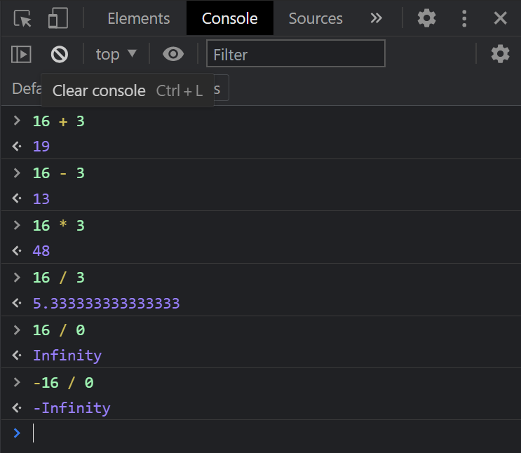
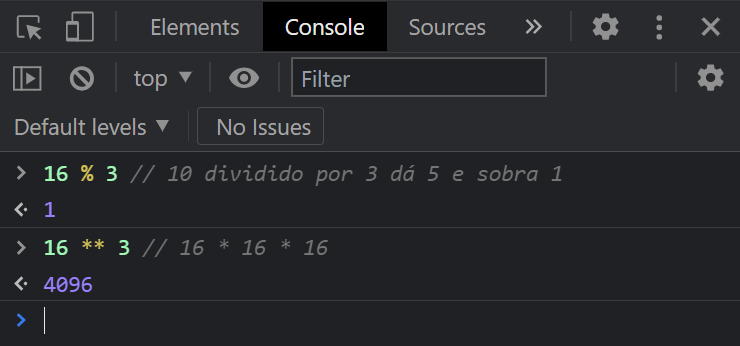
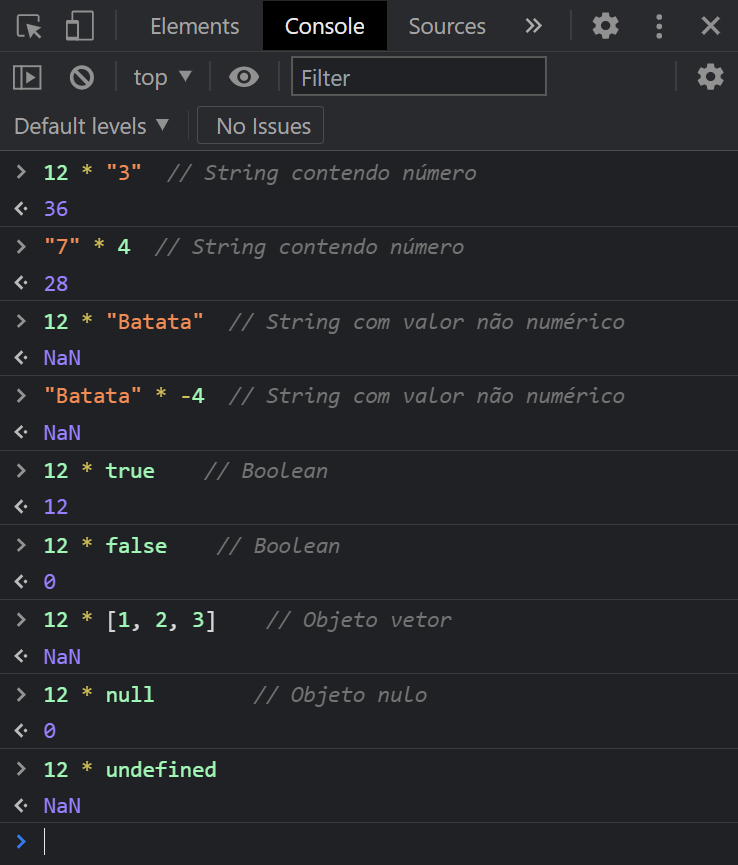
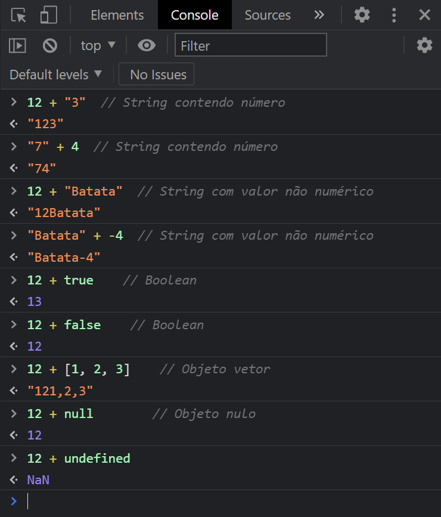

# OPERADORES

## Operadores aritméticos

Convivemos com os operadores aritméticos das quatro operações básicas desde o Ensino Fundamental. A maior parte das pessoas não terá problemas com os operadores das quatro operações aritméticas básicas. Quem usa computador há algum tempo sabe que o caractere `*` é usado para multiplicação e o caractere `/` é empregado na divisão.

É assim também no JavaScript, como ilustra a @fig:aritm.

{#fig:aritm}

> **OBSERVAÇÃO**: ao contrário da maioria das linguagens de programação (e até da sua calculadora), JavaScript não retorna erro quando há uma tentativa de divisão por zero. Em vez disso, ele retorna `Infinity` caso o dividendo seja positivo ou `-Infinity` se o dividendo for negativo. Existem razões matemáticas para tanto. Há uma bela discussão sobre isso [aqui](https://pt.stackoverflow.com/questions/214335/porque-javascript-retorna-infinity-em-vez-de-erro-ao-dividir-por-0).

Além deles, a linguagem conta com mais dois operadores aritméticos (@fig:mod-pot):

* **`%`**: é o operador de **resto da divisão**, também chamado de módulo da divisão. Calcula quanto sobra (o resto) da divisão de um número pelo outro.
* **`**`**: dois asteriscos consecutivos representam o operador de **potenciação**, que calcula o resultado do primeiro número elevado à potência do segundo.

{#fig:mod-pot}

### Quando os operandos não são números

Os operadores aritméticos funcionam como esperado quando seus operandos são números. Mas, e quando não são? Aí **depende**.

Vamos fazer alguns testes com o operador de multiplicação (@fig:mult-nan).

{#fig:mult-nan}

Sem dúvida, são resultados supreendentes. Vamos analisar caso a caso:

1. Quando um dos operandos é *string*, temos duas possibilidades:
   a) se o conteúdo da *string* equivaler a um valor numérico, o JavaScript efetua automaticamente a conversão de tipos e trata o valor da *string* como número, e temos o resultado da operação aritmética como se todos os operandos fossem numéricos.
   b) se o conteúdo da *string* não contiver um valor que possa ser convertido para número, a operação aritmética é impossível e recebemos, para indicar esse fato, o valor especial `NaN`, que significa **Not a Number** (não é um número).
2. No caso de um dos operandos ser *boolean*, o valor **`true`** é tratado como se valesse `1` e o valor **`false`** é considerado como `0`, e a operação aritmética é feita normalmente.
3. No caso de operandos do tipo *object*, não é possível efetuar a operação, portanto recebemos o resultado `NaN`. Uma exceção é o objeto nulo (**`null`**), que é tratado como `0` e possibilita a operação.

| CONFIRA VOCÊ MESMO(A) |
|------------|
| Resultados semelhantes são obtidos com os operadores de subtração (`-`), divisão (`/`), resto da divisão (`%`) e potenciação (`**`). Agora é a sua vez de abrir as Ferramentas do Desenvolvedor (tecle `F12` no navegador) e fazer seus próprios testes. |

Se você for observador(a), vai notar que eu não mencionei o operador `+` na observação anterior. Isso foi proposital, pois ele tem um comportamento diferente dos demais (@fig:add-str).

{#fig:add-str}

Esquisito? Que nada, vamos entender o porquê desses resultados.

Primeiramente, precisamos aprender que o **operador `+`  tem duas funções** diferentes no JavaScript:

1. Se **todos os operandos forem numéricos**, ou puderem ser convertidos para números (ou tiverem valores equivalentes a números, como **`true`**, **`false`** e **`null`**), ele agirá como um **operador aritmético de adição**, como estamos acostumados.
2. No entanto, se **pelo menos um de seus operandos for uma *string***, ele terá a função de **operador de concatenação** de *strings*. Concatenar significa "emendar" uma *string* em outra. O JavaScript irá converter todos os demais operandos em *strings* e concatenará tudo em uma única *string* de resultado.

O operador `+` em conjunto com algum valor **`undefined`** sempre retornará `NaN`, e é um caso à parte.

| IMPORTANTE |
|------------|
| Comprender as duas funções do operador `+` (quando há e quando não há *strings* entre os operandos) é **FUNDAMENTAL** para evitar frustrações futuras ao tratar com valores informados pelo usuário. |

### Operadores de atribuição composta

Quem já estudou algoritmos sabe que uma das tarefas mais comuns em programação é a acumulação. Quando estamos somando uma lista de números por exemplo, iniciamos uma variável com o valor `0` e vamos **acumulando** o valor dos números, mais ou menos assim (@lst:acum):

```{ #lst:acum caption="Exemplo de acumulação em variável" .js .number-lines}
    // Somando os valores 10, 20, 30 e 40
    let soma = 0
    soma = soma + 10
    soma = soma + 20
    soma = soma + 30
    soma = soma + 40
    // O valor final da variável soma é 100
```
Observe que, no processo de acumulação, a variável `soma` aparece **antes** e **depois** do sinal de atribuição (`=`). Para casos assim, o JavaScript dispõe de uma série de **operadores de atribuição composta**, como o operador `+=`, que evitam a repetição do nome a variável. Usando-o, o código anterior fica assim (@lst:acum2):

```{ #lst:acum2 caption="Acumulação usando o operador '+='" .js .number-lines}
    // Somando os valores 10, 20, 30 e 40
    let soma = 0
    soma += 10
    soma += 20
    soma += 30
    soma += 40
    // O valor final da variável soma é 100
```
Veja alguns dos outros operadores de atribuição composta na @tbl:opattr:

| Nome | Operador | Exemplo de uso | Significado |
|------|----------|----------------|-------------|
| Atribuição de subtração | `-=` | `x -= 10` | `x = x - 10` |
| Atribuição de multiplicação | `*=` | `x *= 10` | `x = x * 10` |
| Atribuição de divisão | `/=` | `x /= 10` | `x = x / 10` |
| Atribuição de resto de divisão | `%=` | `x %= 10` | `x = x % 10` |
| Atribuição de potenciação | `**=` | `x **= 10` | `x = x ** 10` |
: Operadores de atribuição composta mais comuns {#tbl:opattr}