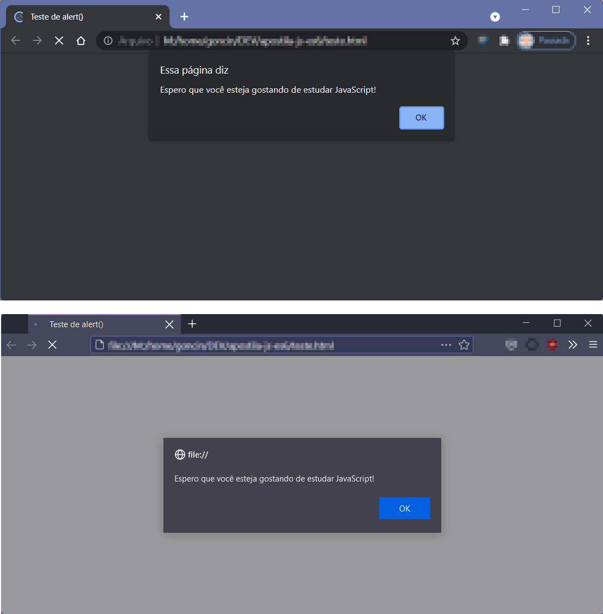
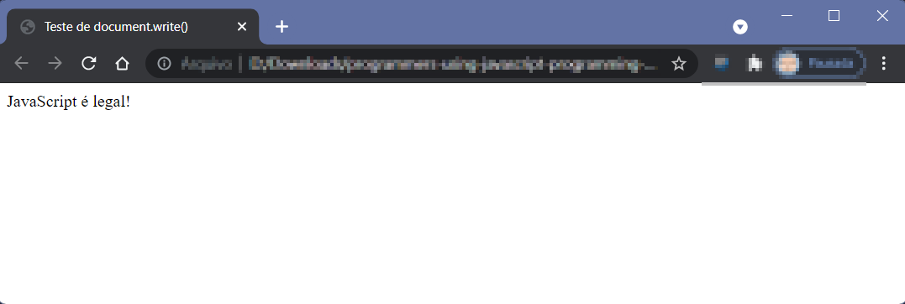
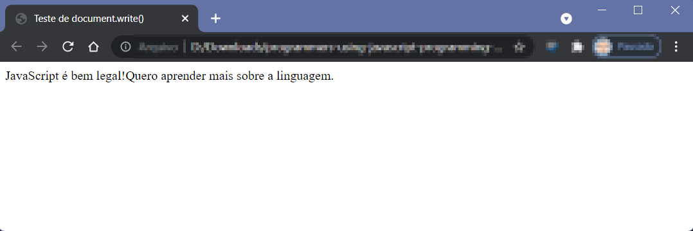
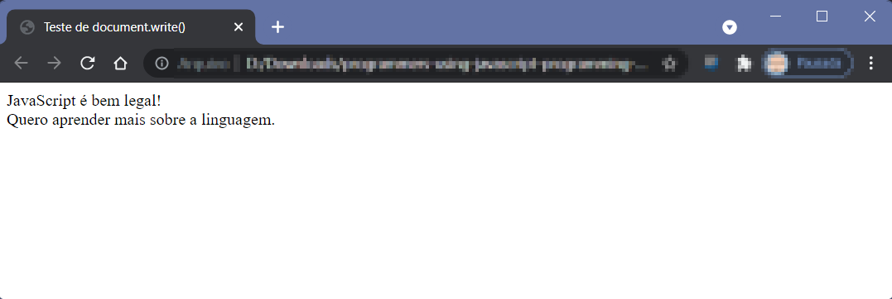
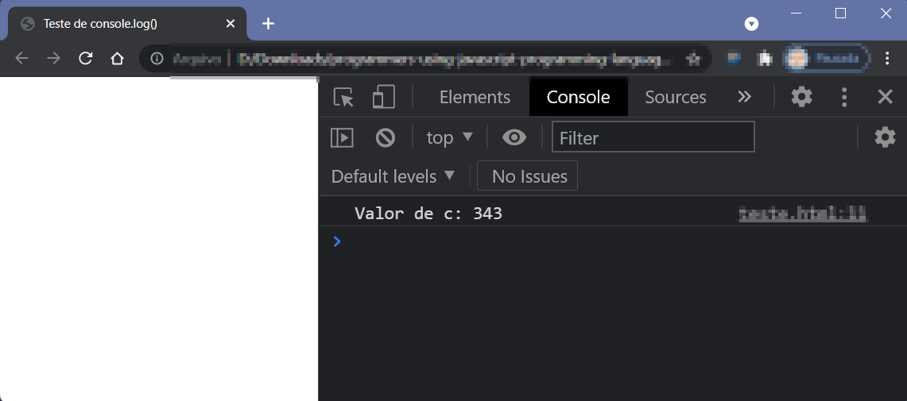
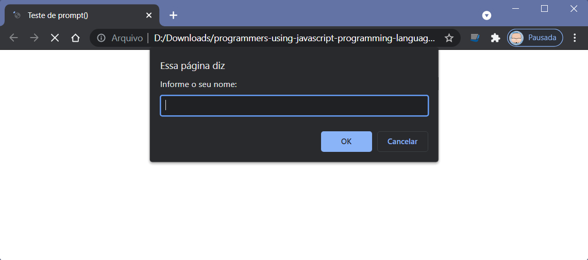

# ENTRADA E SAÍDA

## Exibindo informações

A exibição de informações para o usuário é uma das atividades mais comuns em programação. Afinal, o usuário está usando o computador com um propósito e quer ter *feedback* de suas ações.

Vejamos os diferentes métodos que o JavaScript dispõe para essa finalidade.

### `alert()`

A forma mais simples e comum de exibir algo para o usuário é pelo uso de `alert()`. Já o usamos nos capítulos anteriores, de modo que ele não constitui exatamente uma novidade.

Vamos rever seu funcionamento:

```{.js}
alert('Espero que você esteja gostando de estudar JavaScript!')
```
`alert()` é uma função, que leva como parâmetro a mensagem a ser exibida. Essa mensagem, normalmente, é uma *string*, ou uma variável contendo uma *string*. Caso a parâmetro não seja *string*, será convertido para esse tipo de dado.

A aparência da janela em que aparece a mensagem é definida pelo navegador, e, infelizmente, não temos controle sobre esse ponto. Essa aparência, inclusive, pode variar bastante de um navegador para outro (@fig:alertbrow).

{#fig:alertbrow width=14cm}

A função `alert()` também pode aparecer escrita, às vezes, como `window.alert()`. Trata-se da mesma função, com as mesmas funcionalidades. É como se ela tivesse um nome longo, mais formal, e um nome curto, mais prático.

### `document.write()`

Outra forma de mostrar uma informação textual é escrevendo na seção `<body>` do documento HTML usando `document.write()`. **O resultado será exibido no sempre no início da página**, mesmo que esta já tenha outros conteúdos.

```{.js}
document.write('JavaScript é bem legal!')
```

{#fig:docwrit width=14cm}

Uma peculiariadade de `document.write()` é que ela **não efetua quebras automáticas de linha**. Ou seja, se emitirmos duas chamadas consecutivas à função, o resultado será exibido em uma única linha (@fig:docwrit2).

```{.js}
document.write('JavaScript é bem legal!')
document.write('Quero aprender mais sobre a linguagem.')
```

{#fig:docwrit2 width=14cm}

Para resolver esse problema, precisamos escrever a *tag* HTML `<br>` (de *break row*, quebra de linha, em inglês) no final da primeira mensagem, e usá-la sempre que for necessário pular a linha (@fig:docwrit3).

```{.js}
document.write('JavaScript é bem legal!<br>') // Note o <br> aqui
document.write('Quero aprender mais sobre a linguagem.')
```

{#fig:docwrit3 width=14cm}

### `console.log()`

Este é o método de exibição de informações mais curioso, pois o seu destinatário final não é o usuário, e sim o próprio desenvolvedor. O que `console.log()` faz não aparece em lugar algum para quem está vendo a página, **exceto** se a pessoa teclar `F12` e acessar a aba Console das Ferramentas de Desenvolvedor.

Por isso, `console.log()` é muito usado para testes e depuração, como mostra o exemplo da @lst:conlog.

```{ #lst:conlog caption="Exemplo de uso de console.log()" .js .number-lines}
let a = 7, b = 3, c
c = 7 ** 3
console.log('Valor de c: ' + c)
```

>> **NOTE BEM**: na linha 3, o sinal de `+` não representa uma soma, e sim uma concatenação, já que o primeiro operando é uma *string*.

Confira o resultado na @fig:conlog.

{#fig:conlog width=14cm}

## Coletando informações

Um dos motivos da criação do JavaScript foi permitir que as páginas Web não apenas exibissem informações aos usuários, como também fossem capazes de coletar informações que eles forneçam.

Para isso, a linguagem dispõe de dois métodos, os quais iremos aprender na sequência.

### `prompt()`

A função `prompt()` exibe uma caixa de diálogo, com uma mensagem de instrução e um campo de texto onde o usuário pode digitar o que se pede. O valor informado pelo usuário pode ser coletado em uma variável para uso posterior no código.

Veja um exemplo de uso:

```{.js}
let nome
nome = prompt('Informe o seu nome:')
```

O resultado desse código é semelhante ao retratado na @fig:prompt.

{#fig:prompt width=14cm}

Caso o usuário digite a infomação pedida e clique sobre o botão OK, a variável `nome` receberá o que for informado.

>> **OBSERVAÇÃO**: a função `prompt()` também pode ser escrita como `window.prompt()`.

`prompt()` é muito utilizada em um ciclo que envolve:

1. a coleta da informação (via `prompt()`);
2. o processamento da informação coletada; e
3. a exibição do resultado do processamento, com `alert()`.

Experimente executar o código da @lst:prompt:

```{ #lst:prompt caption="Exemplo de uso combinado de prompt() e alert()" .js .number-lines}
let nome, mensagem
nome = console.log('Informe o seu nome:')
mensagem = 'Olá, ' + nome + '! Tudo bem?'
alert(mensagem)
```

### `confirm()`

Outra forma de solicitar a interação do usuário é usando `confirm()`. Será exibida uma caixa de diálogo com uma mensagem (normalmente uma pergunta) e os botões `OK` e  `Cancelar`. O resultado pode ser coletado em uma variável, que terá um dos seguintes valores:

* **`true`**, se o usuário tiver pressionado o botão `OK` (ou teclar `Enter`);
* **`false`**, caso o usuário tiver pressionado o botão `Cancelar` (ou teclar `Esc`).

Observe o exemplo da @lst:confirm:

```{ #lst:confirm caption="Exemplo de uso de confirm()" .js .number-lines}
let resposta
resposta = confirm('Deseja realmente continuar?')
alert('Sua resposta foi: ' + resposta)
```

>> **OBSERVAÇÃO**: a função `confirm()` também pode ser escrita como `window.confirm()`.

Confira a aparência da caixa de diálogo do `confirm` na @fig:confirm.

{#fig:confirm width=14cm}

__________________

Nossos programas em JavaScript estão ganhando forma. Já sabemos como interagir com o usuário. Nos próximos capítulos, vamos aprender a **controlar** as informações que estão ao nosso dispor.