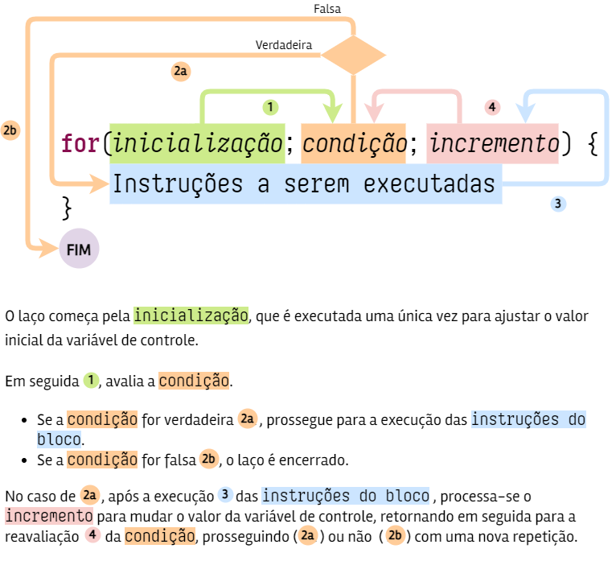

# ESTRUTURAS DE REPETIÇÃO

Computadores, sem dúvida, são máquinas fascinantes. Todavia, por mais inteligentes que pareçam, tudo o que fazem baseia-se em apenas dois fundamentos: **repetir e contar**.

Neste capítulo, vamos aprender como instruir computadores a fazer repetições (também chamadas **iterações**) e contagens. As estruturas de repetição usadas para isso são chamadas, também, de **laços** ou ***loops***.

## **`while`**

O laço mais genérico é o **`while`**, cuja sintaxe é a que segue:

```
while(condição) {
    Instrução ou instruções a serem executadas
}
```

A sintaxe de **`while`** é semelhante à da estrutura condicional **`if`**. Tudo o que dissemos em relação a esta também se aplica agora, ou seja:

1. **`while`** é uma palavra reservada do JavaScript, e, como todas elas, é escrita **em minúsculas**.
2. Os **parênteses** em torno da condição **são obrigatórios**.
3. Condição é um valor booleano, ou que se resolve em um valor booleano (**`true`** ou **`false`**).
4. Depois do parêntese de fechamento da condição, segue-se uma chave de abertura (`{`). Ele indica o início do bloco de instruções que será executado **apenas se a condição for verdadeira**.
5. Uma chave de fechamento (`}`) marca o final do bloco de instruções.

> **OBSERVAÇÃO**: as chaves são opcionais quando há uma única linha de código atrelada à estrutura **`while`**. No entanto, até que você esteja bem familiarizado(a) com a sintaxe do JavaScript, recomendo que sempre use as chaves.

A finalidade do laço **`while`** é repetir a instrução ou instruções no bloco a ele associado, enquanto a condição for verdadeira. O exemplo da @lst:while1 exibirá uma contagem de 1 a 10.

```{ #lst:while1 caption="Exemplo (1) da estrutura de repetição 'while'" .js .number-lines}
let contagem = 1

while(contagem <= 10) {
    document.write(contagem + '<br>')
    contagem++  // Equivale a: contagem = contagem + 1
}
```

Na linha 1, iniciamos a variável com o valor 1. Como esse valor é menor ou igual a 10 (teste do *loop* **`while'** na linha 3), o código do bloco associado à estrutura de repetição será executado uma vez, ou seja: na linha 4, será exibido o valor atual da variável e, na linha 5, esse valor será incrementado. Seguindo, a execução retorna para a linha 3, na qual a condição será reavaliada. Enquanto o valor da variável se mantiver menor ou igual a 10, o bloco será executado novamente. Quando o valor da variável atinge 11, a condição torna-se falsa, e o laço é encerrado.

Neste outro exemplo (@lst:while2), queremos exibir apenas os números mútiplos de 7 e que sejam menores que 100. Para tanto, combinamos a estrutura de repetição **`while`** com a estrutura condicional **`if`**.

```{ #lst:while2 caption="Exemplo (2) da estrutura de repetição 'while'" .js .number-lines}
let num = 1

while(num < 100) {
    if(num % 7 === 0) {
        document.write(contagem + '<br>')
    }
    num++
}
```
> **DICA**: para determinar se um número **a** é divisível por um número **b**, use o operador `%` (resto da divisão inteira), como foi feito na linha 4, e verifique se o valor retornado foi `0`. Ou seja, **a** será divisível por **b** se não houver resto na divisão.

Se a condição inicial do laço **`while`** for falsa, ele não será executado nenhuma vez (@lst:while3). Por isso, dizemos que **`while` não tem garantia de execução**.

```{ #lst:while3 caption="Exemplo (3) da estrutura de repetição 'while'" .js .number-lines}
let x = 20

/* A condição inicial é falsa;
   o loop não será executado */
while(x < 10) {
    document.write(x + '<br>)
    x-- // Equivale a: x = x - 1
}
```

## **`do..while`**

Como vimos, o bloco de instruções associado a um *loop* **`while`** pode nem ser executado se a condição for falsa no começo. Esse comportamento se dá porque **`while`** verifica a condição logo no início, antes mesmo de executar qualquer instrução de seu bloco.

Contudo, há situações em que desejamos que o bloco de instruções seja **executado pelo menos uma vez**. Imagine, por exemplo, que estamos implementando uma rotina na qual o usuário precise informar um valor obrigatoriamente numérico. Já tivemos situações assim nesta apostila, e o que fizemos foi informar uma mensagem de erro caso o valor informado não fosse numérico, encerrando o programa em seguida. Caso o usuário quisesse fazer uma nova tentativa, deveria recarregar a página para forçar a reexecução do código JavaScript.

Com os laços de repetição, podemos fazer melhor. Podemos dar a oportunidade de o usuário informar o valor numérico **uma primeira vez** e, em caso de erro, oferecer novas chances até que ele acerte.

Isso é perfeitamente possível com o uso do *loop* **`do..while`**, cuja sintaxe é mostrada a seguir:

```
do {
    Instrução ou instruções a serem executadas
} while(condição)
```

Vamos analisar cada uma das partes:

1. O laço começa com a palavra-chave **`do`**, seguida da chave de abertura (`{`) do bloco de instruções.
2. No meio do laço, são colocadas as instruções que devem ser executadas por ele, dentro de um bloco.
3. No final, temos a chave de fechamento do bloco (`}`) seguida da palavra-chave **`while`** e da condição do laço entre parênteses (obrigatórios).

Veja que, com essa estrutura, o laço **`do..while`** avalia a condição **apenas no final**. A consequência disso é que, até que a condição seja avaliada, **o bloco de instruções já foi executado**. Com isso, mesmo que a condição se prove falsa, é garantido que o bloco de instruções seja executado pelo menos uma vez.

Usando o *loop* **do..while**, a rotina de entrada de um valor obrigatoriamente numérico pode ser escrita como mostra a @lst:do-while.

```{ #lst:do-while caption="Exemplo de uso do laço 'do..while'" .js .number-lines}
let num

do {
    num = Number(prompt('Informe um valor numérico:'))
} while(isNaN(num))
```

Dessa forma, o usuário será convidado a inserir o valor numérico uma vez, na linha 4. Veja que tentamos converter a entrada informada para número usando `Number()`. Já vimos que, quando a conversão falha, o valor resultante é `NaN` e podemos verificar isso usando a função `isNaN()`. Portanto, caso ele informe algo que não seja numérico, `isNaN(num)` retornará **`true`**, fazendo com que um novo `prompt()` seja exibido ao usuário, dando-lhe uma nova chance de informar um valor numérico. Esse processo irá se repetir enquanto o valor informado não for válido.

Quando o usuário informa, de fato, um valor numérico, a conversão com `Number()` é bem-sucedida e a verificação de `isNaN(num)` retorna **`false`**, dando fim à execução do *loop*.

## **`for`**

Tanto **`while`** quanto **`do..while`** foram projetados para serem executados, no mais das vezes, um número **indeterminado** de vezes; ou seja, as iterações acontecem enquanto a condição se mantiver verdadeira.

Entretanto, uma outra função dos laços de repetição é efetuar contagens, situação em que a quantidade de repetições é **determinada ou determinável**. JavaScript possui o laço **`for`**, especializado em contagens, cuja sintaxe básica é mostrada na @fig:cap06-01.

{#fig:cap06-01 width=14cm}

1. O laço começa com a palavra-chave **`for`**, seguida de um parêntese de abertura. Dentro do parêntese, há três partes distintas, separadas entre si por ponto-e-vírgula (`;`):
   a. A primeira parte, chamada **inicialização**, serve para ajustar o valor inicial da variável que servirá como contadora do laço.
   b. A segunda parte contém uma **condição** que, enquanto se mantiver verdadeira, fará com que o *loop* se repita.
   c. Por fim, temos a parte de **incremento**, na qual o valor da variável contadora é atualizado.
2. Após o parêntese de fechamento (`)`), deve-se colocar a chave de abertura (`{`) do bloco de instruções do laço.
3. Dentro do bloco, naturalmente, vão as instruções que devem ser repetidas pelo laço.
4. O laço é encerrado com a chave de fechamento (`}`) do bloco de instruções.

O exemplo real de código da @lst:for exibe os números de 1 a 10.

```{ #lst:for caption="Laço 'for' para exibir os números de 1 a 10" .js .number-lines}
for(let i = 1; i <= 10; i++) {
    document.write(i + '<br>')
}
```

> **OBSERVAÇÃO**: é comum declarar a variável de controle do *loop* **`for`** dentro da seção de inicialização, com a palavra-chave **`let`**. Note, no entanto, que variáveis declaradas assim deixam de existir tão logo o laço termine, isto é, não é possível saber o valor de `i` na linha de código seguinte ao final do *loop*.

Note, na linha 1:

* a **inicialização**, com `let i = 0`.
* a **condição**, com `i <= 10`.
* o **incremento**, com `i++`.

Temos nesse código, portanto, um laço **`for`** que é controlado pela variável `i`. Esta recebe, na inicialização, seu valor inicial (`0`). Em seguida, como esse valor cumpre a condição (`i` é menor ou igual a `10`), o bloco de instruções é executado, com `document.write()` (linha 2) mostrando o valor de `i`. Prosseguindo, é processado o incremento, no qual o valor de `i` é aumentado em uma unidade, passando a valer `2`. A condição é reavaliada; como `2` é maior ou igual a `10`, o bloco de instruções será executado novamente, depois o incremento, e, por fim, a reavaliação da condição.

Quando `i` atingir o valor `11`, a condição tornar-se-á falsa, encerrando a execução do *loop*.

O laço **`for`** é bastante flexível, permitindo diversas variações. No exemplo da @lst:for2, temos uma contagem regressiva, de 10 a 1.

```{ #lst:for2 caption="Laço 'for' para exibir os números de 10 a 1, em ordem inversa" .js .number-lines}
for(let i = 10; i >= 1; i--) {
    document.write(i + '<br>')
}
```

O que fizemos nesse caso foi inicializar a variável `i` com o valor máximo pretendido (`10`), ajustando a condição para que o laço seja executado enquanto `i` seja **maior ou igual** a `1`. A terceira parte do **`for`**, a rigor, aqui, é um **decremento**, já que precisamos **diminuir** o valor da variável de controle a cada iteração para conseguir o efeito desejado.

Uma outra possibilidade é criar laços cujo incremento (ou decremento) ocorre em intervalos diferentes de 1. O exemplo da @lst:for3 exibe os números entre 0 e 100, contando de 5 em 5.

```{ #lst:for3 caption="Laço 'for' com incremento em intervalo diferente de 1" .js .number-lines}
for(let i = 0; i <=100 1; i += 5) {
    document.write(i + '<br>')
}
```

Repare que, na seção de incremento, a variável `i` ganha 5 unidades a cada repetição do *loop*, usando um operador composto de atribuição.

Outra situação: nem sempre sabemos, no momento da codificação, quantas iterações serão executadas pelo laço **`for`**. Isso pode ser decidido, por exemplo, pelo usuário. Assim, o número de repetições, embora não seja determinado, é **determinável**. Observe a @lst:for4.

```{ #lst:for4 caption="Laço 'for' com uma variável determinando a quantidade máxima de iterações" .js .number-lines}
let quant

do {
    num = parseInt(prompt('Informe a quantidade de asteriscos:'))
} while(isNaN(quant))

for(let i = 1; i <= quant; i++) {
    document.write('*')
}
```

Veja que, em vez de cravarmos um número fixo de repetições (do caractere `*`, no exemplo), é o valor da variável `quant`, informado pelo usuário, que determina esse limite. Note, ainda, como foram usados os *loops* **`do..while`** (linhas 3 a 5) e **`for`** em um mesmo programa, cada qual com sua finalidade inerente.

Por fim, vale comentar que, assim como o *loop* **`while`**, **`for`** também **não tem garantia de execução**, isto é, caso a condição seja falsa logo de início, nada acontecerá.

A @tbl:comprep oferece um comparativo dos três laços de repetição da linguagem JavaScript.

| Laço | Local de verificação da condição | Garantia de execução | Quantidade de iterações |
|------|----------|----------------|-------------|
| **`while`** | No início | 0 vezes | Indeterminada |
| **`do..while`** | No final | 1 vez | Indeterminada |
| **`for`** | No início | 0 vezes | Determinada ou determinável |
: Comparativo entre as estruturas de repetição da linguagem JavaScript {#tbl:comprep}

_________

As estruturas condicionais e de repetição são realmente poderosas. Nossos códigos estão ficando maiores e mais complexos, e isso pode demandar um pouco de organização. No próximo capítulo, vamos aprender como **funções** podem nos ajudar a ter programas mais fáceis de ler e de dar manutenção.